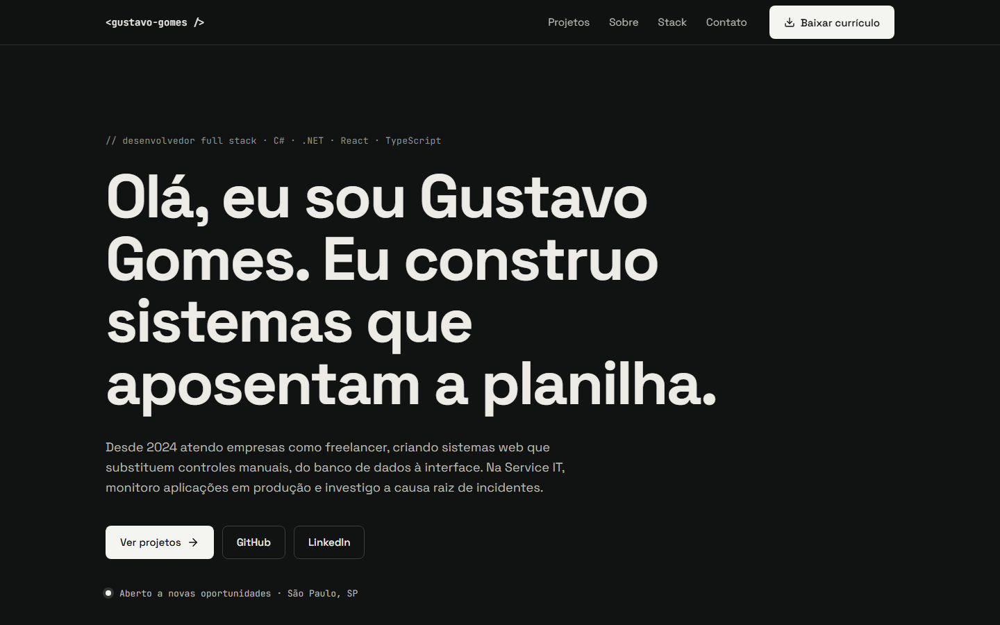

# Portfólio — Gustavo Gomes

Portfólio pessoal de desenvolvedor full stack: página única com projetos, experiência, stack e contato.

**Site:** https://portfolio-two-inky-35.vercel.app



## Stack

- React
- TypeScript
- Vite
- Tailwind CSS

## Como rodar localmente

Requer Node.js 20 ou superior.

```bash
git clone https://github.com/Gustavogomesknt/portfolio.git
cd portfolio
npm install
npm run dev
```

O site abre em `http://localhost:5173`.

Outros comandos:

- `npm run build` — checagem de tipos e build de produção em `dist/`
- `npm run preview` — pré-visualização do build
- `npm run lint` — lint com oxlint

## Onde editar o conteúdo

Todo o conteúdo fica em `src/data`, separado dos componentes:

| Arquivo | Conteúdo |
| --- | --- |
| `site.ts` | nome, e-mail, links, itens do menu e rodapé |
| `hero.ts` | textos da abertura |
| `projects.ts` | projetos (o campo `link` é opcional) |
| `about.ts` | parágrafos da seção "Sobre" |
| `experience.ts` | linha do tempo de experiência e formação |
| `stack.ts` | grupos de ferramentas |

As imagens dos projetos ficam em `public/projects/<slug>.png` (1600x1000). Sem a imagem, o card mostra um placeholder com o nome do projeto.
